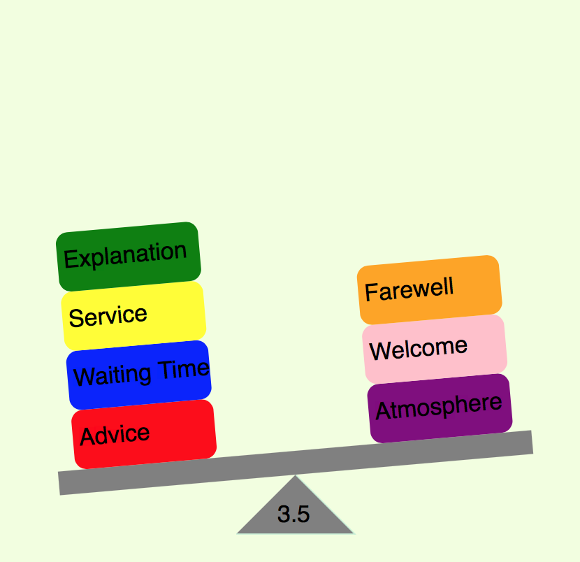

<h2>QSense Balance</h2>

<h3>Introduction</h3>

  This balance is an extension for Qlik Sense. It display a balance based on the label boxes input.

<h3>Installation</h3>
<h4>Desktop</h4>
<ul>
 <li>Download the project (or checkout)</li>
 <li>Unzip the file</li>
 <li>Copy the complete folder to C:\Users\userName\Documents\Qlik\Sense\Extensions</li>
</ul>
<h4>Server</h4>
<ul>
 <li>Download the project (or checkout)</li>
 <li>Go to QMC, Extensions and import the zip file</li>
</ul>
<h3>Case of use</h3>

You can input label boxes on left or right, and show an average number at the pivot.

<h3>Features</h3>
<ul>
  <li>Place boxes to the side defined</li>
  <li>Customize colors of background, pivot, balance, and boxes</li>
  <li>Show the average number of boxes</li>
  <li>Run on Qlik Sense 2.2</li>
</ul>

<h3>Changelog</h3>
<ul>
  <li>1.0.0 Initial version</li>
</ul>
